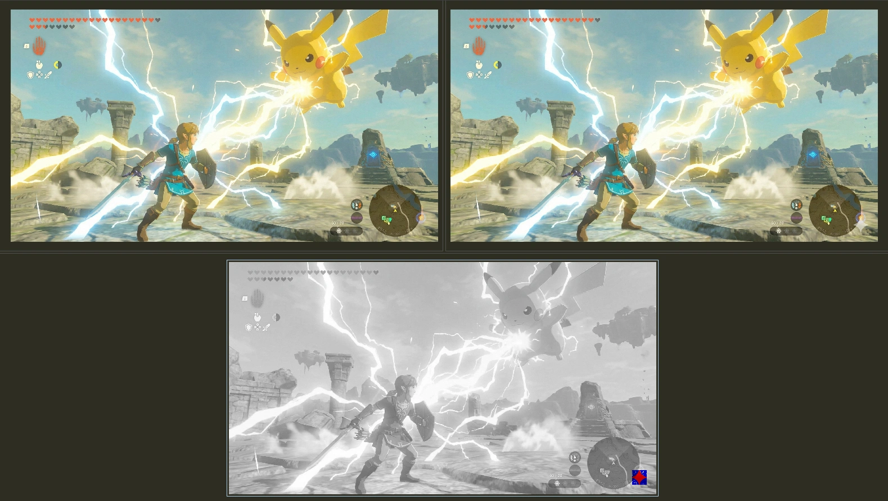
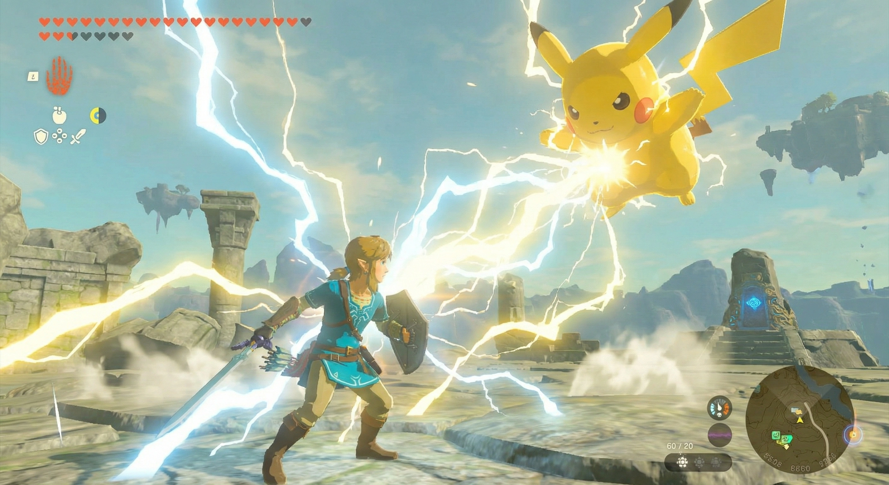
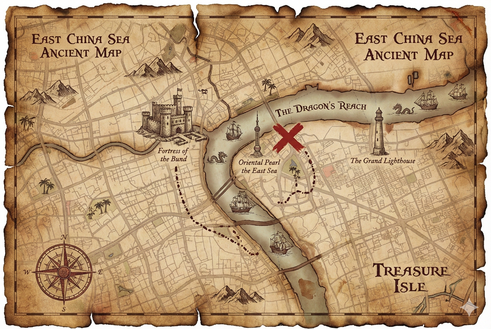
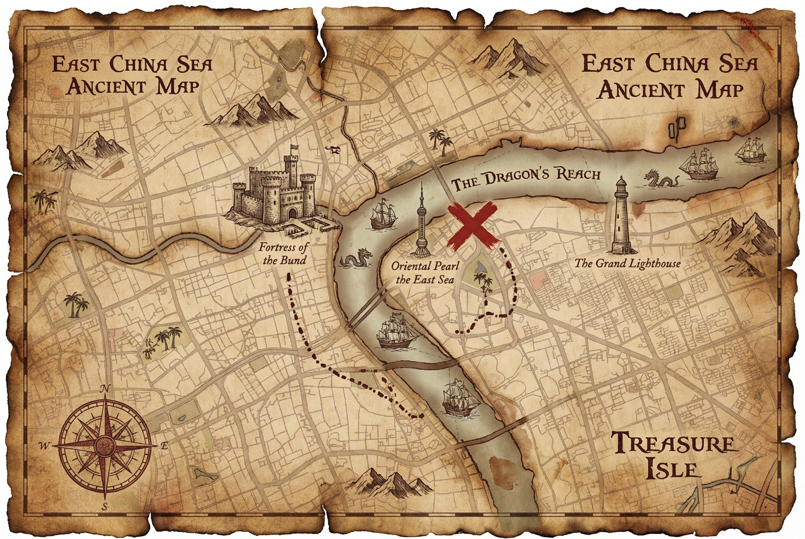
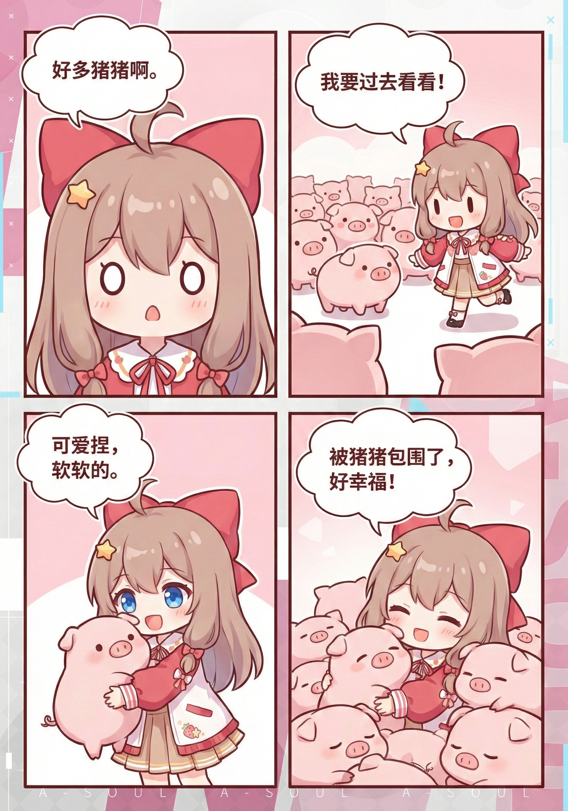

# Gemini Watermark Remover

**A high-performance, 100% client-side Android tool for removing Gemini AI watermarks.**

This app is built entirely with Kotlin and Android native components, leveraging a **mathematically
precise Reverse Alpha Blending algorithm** rather than unpredictable AI inpainting. Unlike other
AI-based tools, it guarantees **consistent, fast, and reliable watermark removal** directly on the
device.

## Features

- Remove watermarks from images without sending them to a server
- Supports single and batch image processing
- Super-smooth comparison slider to preview results
- High-performance algorithm ensures minimal lag on mid-range devices
- Export processed images in PNG format

## Gemini Watermark Removal Examples

> Demo images in the `docs` folder are
> from [GargantuaX/gemini-watermark-remover](https://github.com/GargantuaX/gemini-watermark-remover),
> used under MIT License, with full credit to the original author.  
> The UI workflow is adapted from the JavaScript version for Android.

Click to Expand/Collapse Examples

　

lossless diff example

example images

|           Original Image            |                 Watermark Removed                 |
|:-----------------------------------:|:-------------------------------------------------:|
|  |  |
|  |  |
|  |  |
|  |  |
|  |  |

## ⚠️ Disclaimer

> [!WARNING]
> **USE AT YOUR OWN RISK**
>
> This tool modifies image files. While it is designed to work reliably, unexpected results may
> occur due to:
> - Variations in Gemini's watermark implementation
> - Corrupted or unusual image formats
> - Edge cases not covered by testing
>
> The author assumes no responsibility for any data loss, image corruption, or unintended
> modifications. By using this tool, you acknowledge that you understand these risks.

## How It Works

1. Select an image or multiple images.
2. The app applies the **Reverse Alpha Blending** algorithm to detect and remove Gemini AI
   watermarks.
3. Preview results in a draggable comparison slider.
4. Save unwatermarked images directly to your device.

## Tech Stack

- Android (Kotlin)
- Jetpack Compose / Views
- Native image processing
- Reverse Alpha Blending algorithm

## Limitations

- Only removes **Gemini visible watermarks** <small>(the semi-transparent logo in
  bottom-right)</small>
- Does not remove invisible/steganographic
  watermarks. <small>[(Learn more about SynthID)](https://support.google.com/gemini/answer/16722517)</small>
- Designed for Gemini's current watermark pattern <small>(as of 2026)</small>

## Legal Disclaimer

This tool is provided for **personal and educational use only**.

The removal of watermarks may have legal implications depending on your jurisdiction and the
intended use of the images. Users are solely responsible for ensuring their use of this tool
complies with applicable laws, terms of service, and intellectual property rights.

The author does not condone or encourage the misuse of this tool for copyright infringement,
misrepresentation, or any other unlawful purposes.

**THE SOFTWARE IS PROVIDED "AS IS", WITHOUT WARRANTY OF ANY KIND, EXPRESS OR IMPLIED. IN NO EVENT
SHALL THE AUTHOR BE LIABLE FOR ANY CLAIM, DAMAGES, OR OTHER LIABILITY ARISING FROM THE USE OF THIS
SOFTWARE.**

## Credits

This project is an Android port of
the [Gemini Watermark Tool](https://github.com/allenk/GeminiWatermarkTool) by Allen
Kuo ([@allenk](https://github.com/allenk)).

UI design and workflow inspiration were adapted
from [GargantuaX Gemini Watermark Remover](https://github.com/GargantuaX/gemini-watermark-remover).

The Reverse Alpha Blending method and calibrated watermark masks are based on the original work ©
2024 AllenK (Kwyshell), licensed under MIT License.

## License

[MIT License](./LICENSE)
